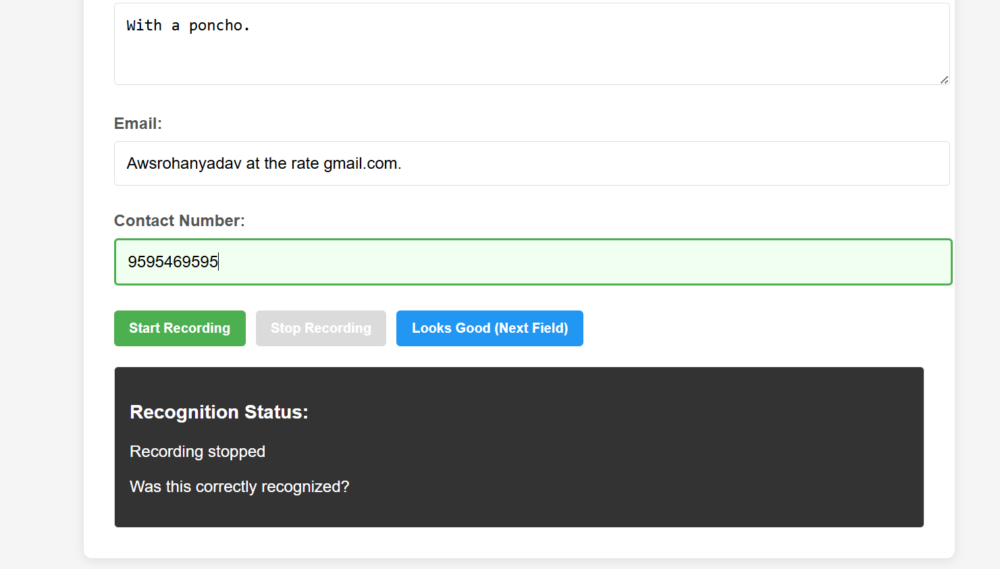

# Voice Form Filler

We can use voice recognition to fill forms.

[Demo Video](https://github.com/user-attachments/assets/be8c74b8-681f-4242-96b2-65a0f696fd38)



## Features

- Voice-based form filling
- Automatic form detection
- Semantic field understanding
- Natural voice commands
- Local AI using Qwen 2.5 3B
- Form validation
- Voice navigation
- Select, radio and checkbox support
- Text-to-speech feedback
- Local processing

## Requirements

- Windows 10 or Windows 11
- Python 3.12
- Git
- Ollama
- FFmpeg

## Installation

### 1. Clone the repository

```powershell
git clone git@github.com:HemanthVelagali/voice-form-filler.git
cd voice-form-filler
```

### 2. Create Python environment

```powershell
python -m venv venv
.\venv\Scripts\Activate.ps1
```

Install dependencies:

```powershell
pip install -r requirements.txt
```

## 3. Download the ASR Model

Create the models directory:

```powershell
New-Item -ItemType Directory -Force models
```

Download the following ASR model:

```text
sherpa-onnx-nemo-parakeet-tdt-0.6b-v2-int8
```

Place it inside:

```text
models\
└── sherpa-onnx-nemo-parakeet-tdt-0.6b-v2-int8\
    ├── encoder.int8.onnx
    ├── decoder.int8.onnx
    ├── joiner.int8.onnx
    └── tokens.txt
```

## 4. Download Kokoro TTS Models

Create the directory:

```powershell
New-Item -ItemType Directory -Force models\kokoro
```

Place these files inside:

```text
models\kokoro\
├── kokoro-v1.0.onnx
└── voices-v1.0.bin
```

## 5. Install FFmpeg

```powershell
winget install Gyan.FFmpeg
```

Verify:

```powershell
ffmpeg -version
```

## 6. Install Ollama

Install Ollama for Windows.

Check:

```powershell
ollama --version
```

Download the AI model:

```powershell
ollama pull qwen2.5:3b
```

Verify:

```powershell
ollama list
```

You should see:

```text
qwen2.5:3b
```

## Running the Application

Open three PowerShell terminals.

### Terminal 1 — Ollama

```powershell
$env:OLLAMA_ORIGINS="http://localhost:8080"
ollama serve
```

### Terminal 2 — AI Server

```powershell
.\venv\Scripts\Activate.ps1
python -m uvicorn ai_server:app --host 127.0.0.1 --port 8090
```

### Terminal 3 — Main Application

```powershell
.\venv\Scripts\Activate.ps1
python main.py
```

The services use:

```text
ASR  → localhost:8001
TTS  → localhost:8000
AI   → localhost:8090
WEB  → localhost:8080
```

## Open the Form

Open:

```text
http://localhost:8080/voice-form.html
```

Allow microphone access and start speaking.

## Example Commands

```text
My name is Hemanth.
```

```text
My email is hemanth at gmail dot com.
```

```text
My phone number is 8341404045.
```

```text
Next field.
```

```text
Previous field.
```

```text
Go to the email field.
```

```text
Submit the form.
```

## Project Structure

```text
voice-form-filler/
│
├── form/
│   ├── action-planner.js
│   ├── dom-executor.js
│   ├── scanner.js
│   ├── semantic-mapper.js
│   ├── speech-cleaner.js
│   └── validator.js
│
├── ai_engine.py
├── ai_server.py
├── asr_server.py
├── tts_server.py
├── main.py
├── fill.js
├── voice-form.html
├── play_voice.html
├── requirements.txt
└── README.md
```

## Author

Hemanth